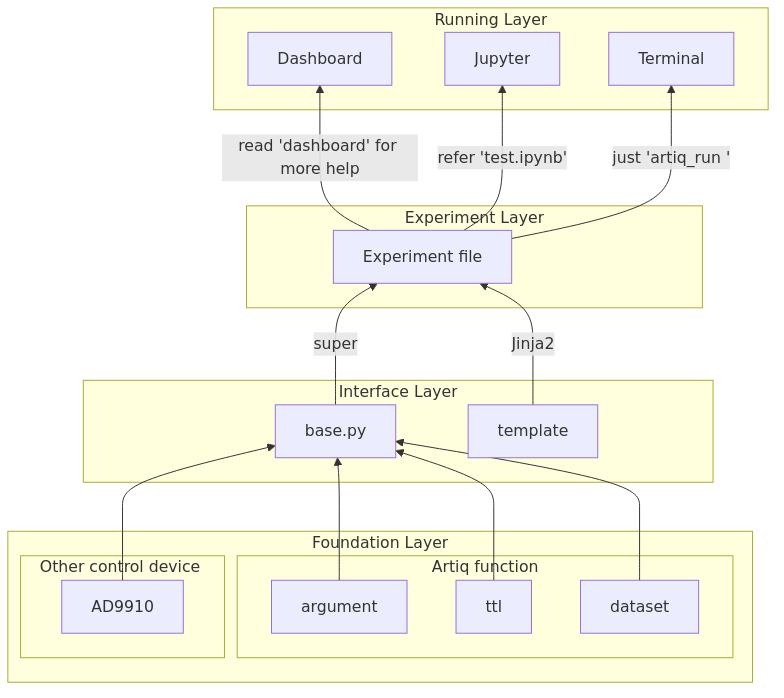

# Project Overview

This project represents a **multi-layered architecture** designed to efficiently manage and execute quantum experiments using the **ARTIQ** system. The architecture is divided into four distinct layers, each playing a crucial role in controlling quantum devices, managing interfaces, running experiments, and providing real-time data visualization. The following sections break down the roles and interactions of each layer.

## **1. Foundation Layer**
The **Foundation Layer** consists of two primary components: 
- **ARTIQ Function**: This includes essential components like:
    - **Argument Parsing**: For processing input arguments required for the experiment.
    - **Dataset Management**: Handling data during the experiment execution.
    - **Artiq device**: Managing artiq device like ttl or dac.

- **Other Control Device Program**: This subgraph integrates the **AD9910**, a **Direct Digital Synthesizer (DDS)** used for **frequency generation** and **synchronization**.

## **2. Interface Layer**
The **Interface Layer** serves as the bridge between the **Foundation Layer** and the higher layers. It includes:
- **base.py**: A foundational Python script responsible for managing experiment configurations. In special, It should define the necessary segement function.
- **Template**: A templating engine (e.g., Jinja2) to dynamically generate the control code required for execution.

The Interface Layer ensures smooth data transfer and control flow between the Foundation Layer and the **Experiment Layer**.

## **3. Experiment Layer**
The **Experiment Layer** defines the core **experiment files**, where quantum operations are defined and executed. This layer allows the **Interface Layer** to:
- Load and execute the necessary experiment files.
- Apply the parameters generated from the lower layers.

It communicates with the Interface Layer, using commands like **super** for system supervision and **Jinja2** for dynamic file creation.

## **4. Running Layer**
The **Running Layer** is the real-time execution environment for monitoring and controlling the experiment. It includes:
- **Dashboard**: Provides real-time data visualization for the ongoing experiment.
- **Jupyter Notebooks**: Allows referring to experiment results through interactive notebooks.
- **Terminal**: Enables direct command execution, such as running `artiq_run`.

## **Architecture Diagram**

Below is the visual representation of the system architecture, showing the interaction between the layers:

## Conclusion
By organizing the system into these layers, the project ensures modularity and flexibility. This architecture reduces complexity and improves usability, making it easier to modify and extend the system as new components are added or existing functionalities adjusted.
